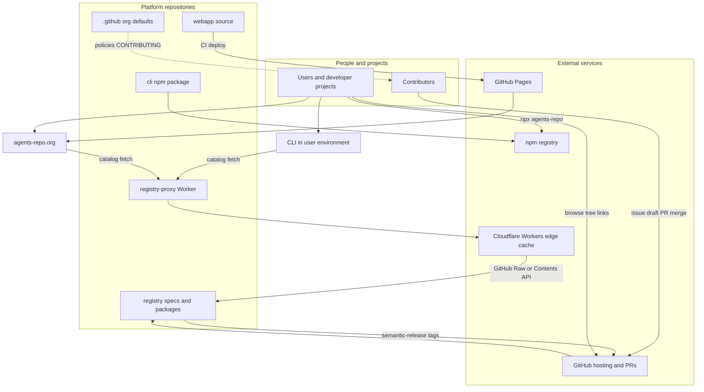
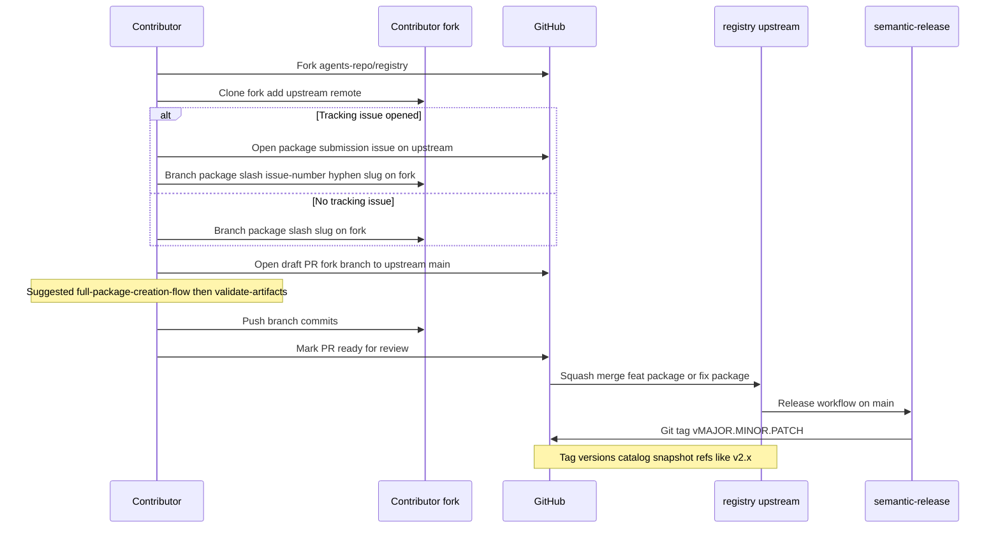
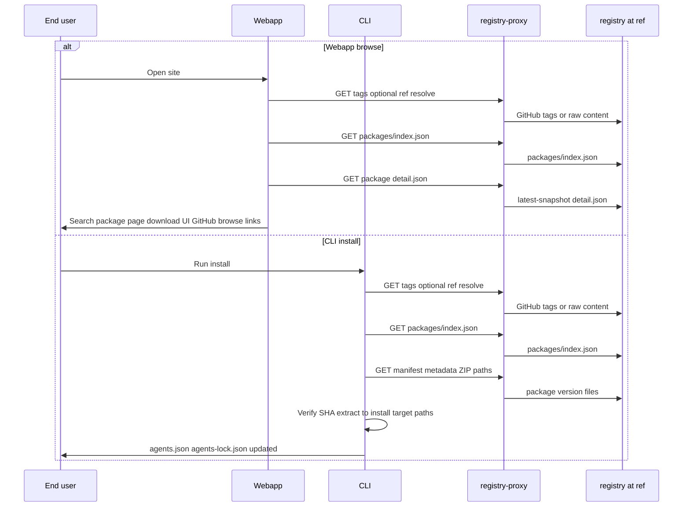
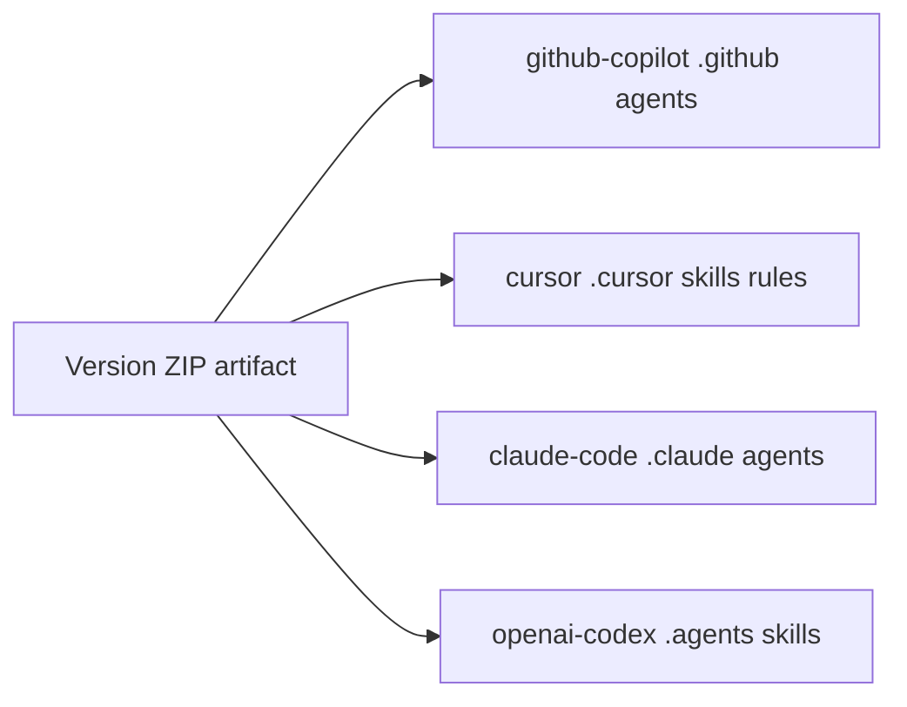

# Ecosystem overview

The **agents-repo** organization is an open registry and tooling stack for
agents and multi-agent flows across supported **install targets** (GitHub
Copilot, Cursor, Claude Code, and OpenAI Codex). Specifications and package
source live in the **registry** repository. **Webapp** and **CLI** consumers
read catalog files through **registry-proxy** by default (webapp and CLI can
point at GitHub or other bases via env and project config). Organization-wide
policies and this diagram live in the **[`.github`](https://github.com/agents-repo/.github)**
repository.

## System context

## Repository index

| Repository | Role |
| --- | --- |
| [registry](https://github.com/agents-repo/registry) | Normative specs, `packages/` catalog, validation and build tooling, version ZIPs |
| [registry-proxy](https://github.com/agents-repo/registry-proxy) | Read-only Cloudflare Worker: cached access to registry files and tag listing |
| [webapp](https://github.com/agents-repo/webapp) | Browse, search, and download UI; deploys to [agents-repo.org](https://agents-repo.org/) |
| [cli](https://github.com/agents-repo/cli) | Official `npx agents-repo` installer and project config (`agents.json`, lockfile) |
| [.github](https://github.com/agents-repo/.github) | Organization profile, CONTRIBUTING, security and support defaults |

Public site: [agents-repo.org](https://agents-repo.org/) (built from **webapp**;
Pages target [agents-repo.github.io](https://github.com/agents-repo/agents-repo.github.io)).

Default catalog fetch URL (webapp production and org `agents.json`):

`https://registry.agents-repo.org?ref=v2.x`

Override with webapp `VITE_*` registry settings, CLI `agents.json` / env (for
example `AGENTS_REPO_REGISTRY_URL`), or a direct GitHub source URL in development.

## Publish a package

New or updated packages are contributed to **registry** via pull request from a
contributor fork (or upstream branch for maintainers). Runtime logic stays out of
the registry; contributors add source under
`packages/<namespace>/<package-id>/`, build ZIP artifacts, and update catalog
metadata. The suggested authoring path after the draft pull request is
`full-package-creation-flow` in the registry clone (already extracted from
`agents-repo/agents-repo-package-creation`), then the same validate/build
gate. See [Submit a
package](https://agents-repo.org/docs/submitting-a-package).

Squash-merge titles MUST use `feat(package):` or `fix(package):` so registry
release tags publish. See the [package submission issue
form](https://github.com/agents-repo/registry/blob/main/.github/ISSUE_TEMPLATE/package-submission.yml)
and [registry
CONTRIBUTING](https://github.com/agents-repo/registry/blob/main/.github/CONTRIBUTING.md).

## Browse or install from the catalog

Webapp and CLI both resolve a catalog ref (including major-line aliases such as
`v2.x`) and load `packages/index.json`. After that, the paths split:

- **Webapp package pages** fetch
  `packages/<namespace>/<package-id>/detail.json` (generated latest-snapshot
  aggregate; optional `readmeMarkdown`).
- **CLI install** fetches
  `packages/<namespace>/<package-id>/versions/manifest.json`, plus
  version-scoped `metadata.json` and `<version>-<target-id>.zip` artifacts
  under `packages/<namespace>/<package-id>/versions/<version>/`.

Proxy behavior: [registry-proxy
ARCHITECTURE](https://github.com/agents-repo/registry-proxy/blob/main/docs/ARCHITECTURE.md).
CLI pipeline: [install
command](https://github.com/agents-repo/cli/blob/main/docs/commands/install.md).

Webapp fetches through the proxy (or configured base URL) but may link to the
**registry** tree on GitHub for source browsing (`VITE_REGISTRY_GITHUB_REPOSITORY_URL`).

## Install targets

Packages declare supported **install targets** in catalog metadata. The CLI
extracts version ZIPs into IDE-specific paths in the consumer project (or global
home with `-g`).

Install target IDs are normative in the registry
[`install-targets.md`](https://github.com/agents-repo/registry/blob/main/specs/install-targets.md)
spec. Marketing names: [marketing-vocabulary.md](marketing-vocabulary.md).

## Presentation decks

PDF walkthroughs (Marp source + committed PDF) live under
[`docs/slides/`](slides/README.md). Start with the
[ecosystem overview](slides/pdf/ecosystem-overview.pdf) and
[contributing workflow](slides/pdf/contributing-workflow.pdf) decks, then the
per-repo indexes linked from that slides README.

## Related links

- Organization [Required Workflow](../CONTRIBUTING.md#required-workflow)
- Organization [branch prefix reference](../CONTRIBUTING.md#branch-prefix-reference)
- [Registry package submission](https://github.com/agents-repo/registry/issues/new/choose)
- [Webapp development](https://github.com/agents-repo/webapp/blob/main/docs/development.md)
- [CLI architecture](https://github.com/agents-repo/cli/blob/main/docs/ARCHITECTURE.md)
- [Webapp deployment](https://github.com/agents-repo/webapp/blob/main/docs/deployment.md)
