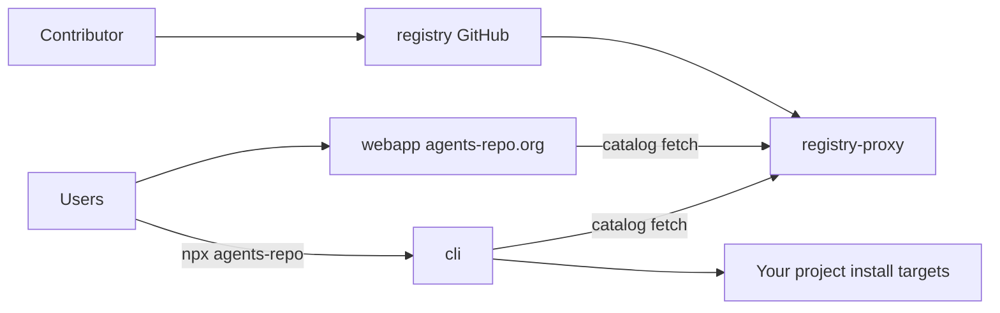

# agents-repo

Open-source registry and tooling for agents and multi-agent flows across
supported **install targets** (AI coding tools).

The agents-repo organization maintains specifications, packages, and
applications for discovering, validating, and distributing agents and flows
for GitHub Copilot, Cursor, Claude Code, and OpenAI Codex.

## Get started

- [registry](https://github.com/agents-repo/registry) — specifications, schemas, packages, and validation tooling
- [webapp](https://github.com/agents-repo/webapp) — browse, search, and download agents and flows from the registry
- [registry-proxy](https://github.com/agents-repo/registry-proxy) — cached, rate-limit-safe access to registry files
- [cli](https://github.com/agents-repo/cli) — install and manage packages with `npx agents-repo`
- [Repositories on agents-repo.org](https://agents-repo.org/repositories) — stable site pages for every org repository
- [agents-repo.org](https://agents-repo.org/) — public site (develop in
  [webapp](https://github.com/agents-repo/webapp); published automatically to
  [agents-repo.github.io](https://github.com/agents-repo/agents-repo.github.io))

## How the ecosystem fits together

Contributors publish packages to **registry** via GitHub pull request. **Webapp**
and **CLI** use **registry-proxy** for catalog fetches by default (overridable
via env and config in local development). The public site is built from
**webapp** and deployed to GitHub Pages.

Full diagrams and step-by-step flows: [Ecosystem overview](../docs/ecosystem.md).

## Contribute

Every task MUST follow the organization [Required Workflow](../CONTRIBUTING.md#required-workflow):
open a tracking issue, create a branch, push, and open a draft pull request
(`gh pr create --draft`) before implementation. After validation, the
developer manually marks the pull request ready for review.

Each repository has its own contributing guide with setup, validation, and pull
request expectations. Start with the organization-wide
[Contributing guide](../CONTRIBUTING.md),
then follow the detailed guide for the repository you are changing:

- [registry/.github/CONTRIBUTING.md](https://github.com/agents-repo/registry/blob/main/.github/CONTRIBUTING.md)
- [webapp/.github/CONTRIBUTING.md](https://github.com/agents-repo/webapp/blob/main/.github/CONTRIBUTING.md)
- [registry-proxy/.github/CONTRIBUTING.md](https://github.com/agents-repo/registry-proxy/blob/main/.github/CONTRIBUTING.md)
- [cli/.github/CONTRIBUTING.md](https://github.com/agents-repo/cli/blob/main/.github/CONTRIBUTING.md)

`agents-repo.github.io` is the webapp's automated Pages deploy target, not a
development repository. See [webapp deployment docs](https://github.com/agents-repo/webapp/blob/main/docs/deployment.md).

For organization-wide defaults and policies, open an issue before
implementation in [agents-repo/.github](https://github.com/agents-repo/.github).

## Community

- [Code of Conduct](https://github.com/agents-repo/.github/blob/main/CODE_OF_CONDUCT.md)
- [Security policy](https://github.com/agents-repo/.github/blob/main/SECURITY.md)
- [Support](https://github.com/agents-repo/.github/blob/main/SUPPORT.md)
